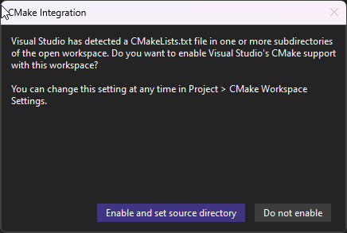

# IFdataGen - SignalSim IF Data Generator

## Overview

IFdataGen is a component of the SignalSim project that generates GNSS Intermediate Frequency (IF) data for various satellite navigation systems. The generated binary files can be used with RF front-ends or GNSS software-defined radio applications.

## GNSS Signal Frequencies and Bandwidths

Global Navigation Satellite Systems (GNSS) operate in specific frequency bands allocated by the International Telecommunication Union (ITU). Understanding these frequencies and the bandwidths of the signals is crucial for signal generation and processing.

Here's a summary of the center frequencies (Fc) for major GNSS signals:

| Constellation | Signal | Frequency Band | Center Frequency (Fc) (MHz) | Typical Bandwidth (MHz) | Min Fs (MHz) |
|---------------|--------|----------------|-----------------------------|-------------------------|--------------|
| **GPS**       | L1 C/A | L1             | 1575.42                     | 2.046 (main lobe)       | 2.046        |
|               | L1C    | L1             | 1575.42                     | 4.092                   | 4.092        |
|               | L2C    | L2             | 1227.60                     | 2.046 (L2CM)            | 2.046        |
|               | L5     | L5             | 1176.45                     | 20.46                   | 20.46        |
| **BeiDou (BDS)**| B1C  | B1             | 1575.42                     | 4.092                   | 4.092        |
|               | B1I    | B1             | 1561.098                    | 4.092                   | 4.092        |
|               | B2I    | B2             | 1207.14                     | 4.092                   | 4.092        |
|               | B2a    | B2             | 1176.45                     | 20.46                   | 20.46        |
|               | B2b    | B2             | 1207.14                     | 20.46                   | 20.46        |
|               | B3I    | B3             | 1268.52                     | 20.46                   | 20.46        |
| **Galileo**   | E1     | L1/E1          | 1575.42                     | 4.092 (OS)              | 4.092        |
|               | E5a    | L5/E5a         | 1176.45                     | 20.46                   | 20.46        |
|               | E5b    | E5b            | 1207.14                     | 20.46                   | 20.46        |
|               | E5 AltBOC | E5          | 1191.795                    | 51.15                   | 51.15        |
|               | E6     | E6             | 1278.75                     | 40.92                   | 40.92        |
| **GLONASS**   | G1     | L1             | 1602 + k * 0.5625 (k=-7..+6)| ~1 per channel          | 8 - 10       |
|               | G2     | L2             | 1246 + k * 0.4375 (k=-7..+6)| ~0.8 per channel        | 6 - 8        |
|               | G3     | L3             | 1202.025                    | 4.092                   | 4.092        |

**Notes:**

* **Bandwidth:** The listed bandwidths are approximate and can vary depending on the specific definition (e.g., main lobe, null-to-null, 99% power). For GLONASS FDMA signals, the listed bandwidth (~1 MHz for G1, ~0.8 MHz for G2) is for a *single satellite channel*. Capturing the *entire* G1 constellation requires a bandwidth of approximately 8-10 MHz, and the entire G2 constellation requires approximately 6-8 MHz.
* **Minimum Sampling Frequency (Min Fs):** This column indicates the theoretical minimum sampling frequency required to capture the signal without aliasing, based on the Nyquist-Shannon sampling theorem. For complex (I/Q) sampling, the minimum sampling rate is equal to the signal's bandwidth. For GLONASS, the Min Fs listed corresponds to a single channel; capturing the full constellation requires sampling at rates corresponding to the full constellation bandwidths mentioned above. The actual sampling frequency (`Fs`) used in a receiver or simulator (shown in the testing status tables below) is often higher to accommodate filter roll-off, capture multiple signals, or simplify processing.

## Signal Support and Testing Status

### Single-Constallations

The **`Fc`** and **`Fs`** in table below are the valuse used in **`.json`** file.

| Constellation | Signal          | Fc (MHz)  | Fs ( MHz) | Implementation  | Signal Generation Testing Status (Notes) | Signal Processing Testing Status (Notes) |
|---------------|-----------------|-----------|-----------|-----------------|-----------------------------------|-----------------------------------|
| **GPS**       | L1CA            | 1575.42   | 2.1       | 🟢              | 🟢                               | 🟡                                |
|               | L1C             | 1575.42   | 4.1       | 🟢              | 🟡 (L1CA is generated as well)   | 🟡                                |
|               | L2C (L2CM)      | 1227.60   | 4.1       | 🟢              | 🟢                               | 🟡                                |
|               | L5              | 1176.45   | 21        | 🟢              | 🟢                               | 🟡                                |
|               | L1P/L2P         | ----      | ---       | (Commercial license only)| (Commercial license only)| (Commercial license only)         |
| **BeiDou**    | B1C             | 1575.42   | 4.1       | 🟢              | 🟡 (L1CA is generated as well)   | 🟡                                |
|               | B1I             | 1561.098  | 4.1       | 🟢              | 🟡 (L1CA is generated as well if comes in bandwidth) | 🟡            |
|               | B2I             | 1207.14   | 4.1       | 🟢              | 🟢                               | 🟡                                |
|               | B2a             | 1176.45   | 21        | 🟢              | 🟢                               | 🟡                                |
|               | B2b             | 1207.14   | 21        | 🟢              | 🟢                               | 🟡                                |
|               | B3I             | 1268.52   | 21        | 🟢              | 🟢                               | 🟡                                |
| **Galileo**   | E1              | 1575.42   | 4.1       | 🟢              | 🟡 (L1CA is generated as well)   | 🟡                                |
|               | E5a             | 1176.45   | 21        | 🟢              | 🟢 (F/NAV data modulation)       | 🟡                                |
|               | E5b             | 1207.14   | 21        | 🟢              | 🟢 (I/NAV data modulation)       | 🟡                                |
|               | E5 AltBOC       | ----      | ---       | (Commercial license only)| (Commercial license only)|  (Commercial license only)        |
|               | E6              | 1278.75   | 41        | 🟢              | 🟢                               | 🟡                                |
| **GLONASS**   | G1              | 1602      | 10        | 🟢              | 🟢 (FDMA implementation)         | 🟡                                |
|               | G2              | 1202.025  | 8         | 🟢              | 🟢 (FDMA implementation)         | 🟡                                |

### Multi-Constellations

| Constellation                         |  Signals                          |  Fc (MHz) | Fs ( MHz) | Signal Generation Testing Status (Notes)  | Signal Processing Testing Status (Notes)  |
|---------------------------------------|-----------------------------------|-----------|-----------|-------------------------------------------|-------------------------------------------|
| **GPS + BeiDou + Galileo**            | [L1CA + L1C + B1C + E1](GNSS_Signal_Calculations.md#1-l1ca--l1c--b1c--e1)             | 1575.42   | 4.092     | 🟢                                        | 🟡                                       |
| **GPS + BeiDou + Galileo**            | [L1CA + L1C + B1C + B1I + E1](GNSS_Signal_Calculations.md#2-l1ca--l1c--b1c--b1i--e1)       | 1568.286  | 18.48     | 🟢                                        | 🟡                                       |
| **GPS + BeiDou + Galileo + GLONASS**  | [L1CA + L1C + B1C + B1I + E1 + G1](GNSS_Signal_Calculations.md#3-l1ca--l1c--b1c--b1i--e1--g1)  | 1582.2105 | 46.329    | 🟢                                        | 🟡                                       |
| **GPS + BeiDou + Galileo + GLONASS**  | [L2C + B2I + B2b + E5b + G2](GNSS_Signal_Calculations.md#4-l2c--b2i--b2b--e5b--g2)        | 1221.88   | 53.49     | 🟢                                        | 🟡                                       |
| **GPS + BeiDou + Galileo**            | [L5 + B2a + E5a](GNSS_Signal_Calculations.md#5-l5--b2a--e5a)                    | 1176.45   | 24        | 🟢                                        | 🟡                                       |
| **BeiDou + Galileo**                  | [B3I + E6](GNSS_Signal_Calculations.md#6-b3i--e6)                          | 1273.64   | 30.75     | 🟢                                        | 🟡                                       |

> **Legend**:
>
> * 🟢 Working / Complete: Feature has been fully implemented and verified
> * 🟡 Limited / Partial / Not Tested: Feature has partial implementation or limited verification or not tested
> * 🔴 Not Working: Feature is not implemented or not functioning correctly

### Note

> 1. The `" Signal Generation Testing Status"` indicates that the signals for the respective frequency bands have been successfully generated. However, the detailed evaluation of their characteristics—such as spectral purity, phase noise, modulation accuracy, and overall signal integrity—has not yet been performed.​
> 2. The `" Signal Processing Testing Status"` indicates the testing of generated binary IF data file in a softwred based GNSS Reciver , like Pocket SDR, GNSS SDR etc.
> 3. For details on **`Fc`** and **`Fs`**  calculations, please refer to the [detailed calculations document](./GNSS_Signal_Calculations.md).

## Build Instructions on Windows

### Prerequisites

* Microsoft Visual Studio (tested with VS 2022)
* CMake support enabled in Visual Studio (included by default in recent versions)

### Steps to Build IFdataGen

#### 1. Obtain the Repository

Either clone the repository to your PC:

``` cmd
git clone https://github.com/MuhammadQaisarAli/SignalSim.git
```

Or download the ZIP archive and extract it.

#### 2. Open the Project Folder

* Launch Visual Studio
* Navigate to File > Open > Folder...
* Browse to the cloned SignalSim repository and select the `SignalSim` folder

#### 3. Configure the CMake Project

* Upon opening the folder, Visual Studio will detect the `CMakeLists.txt` files and a `CMake Integration` popup will appear

  

* Click `Enable and set source directory` and select the `CMakeLists.txt` file located at `<path-to-repo>/SignalSim/IFdataGen/CMakeLists.txt`
* Wait for the configuration process to complete. You should see this output in the console:

  ``` cmd
  1> Extracted CMake variables.
  1> Extracted source files and headers.
  1> Extracted code model.
  1> Extracted toolchain configurations.
  1> Extracted includes paths.
  1> CMake generation finished.
  ```

#### 4. Build the Project

* Once the configuration is complete, build the project by navigating to Build > Build All or pressing `Ctrl + Shift + B`
* Upon successful build, you should see:

  ``` cmd
  [32/32] Linking CXX executable IFdataGen.exe

  Build All succeeded.
  ```

* The `IFdataGen.exe` executable will be generated in `<path-to-repo>/SignalSim/IFdataGen/out/build/x64-Debug/` folder

## Running IFdataGen

### 1. Configure the Input JSON File

* Navigate to the `/SignalSim/IFdataGen/configs/` directory and open `IfGenTest.json` in a text editor
* Update the `ephemeris` section with the absolute path to your RINEX file:

  ```json
  "ephemeris": {
      "type": "RINEX",
      "name": "D:\/SignalSim\/EphData\/BRDC00IGS_R_20211700000_01D_MN.rnx"
  }
  ```

* The provided `BRDC00IGS_R_20211700000_01D_MN.rnx` is a mixed RINEX file containing data for multiple constellations (GPS, Galileo, BeiDou, GLONASS)
* By default, only GPS L1CA signals are selected for generation

### 2. Generate the IF Data

* Open a command prompt in the build directory `<path-to-repo>/SignalSim/IFdataGen/out/build/x64-Debug/`
* Run the following command:

  ```cmd
  IFdataGen.exe "<path-to-repo>/SignalSim/IFdataGen/configs/IfGenTest.json"
  ```

  Example:

  ```cmd
  IFdataGen.exe "D:/SignalSim/IFdataGen/configs/IfGenTest.json"
  ```

* On successful execution, you'll see output similar to:

  ``` cmd
    Generate IF data with following satellite signals:
    GPS visible SVs 9.
    BDS visible SVs 0.
    Galileo visible SVs 0.
    Glonass visible SVs 0.

    GPS L1CA with IF -4580kHz
            SV03 with Doppler -3765Hz
            SV04 with Doppler -1899Hz
            SV07 with Doppler 893Hz
            SV08 with Doppler 2480Hz
            SV09 with Doppler 133Hz
            SV14 with Doppler 3721Hz
            SV16 with Doppler -3263Hz
            SV27 with Doppler 1169Hz
            SV30 with Doppler 2352Hz
  Generate IF data completed    490 ms
  ```

* A binary file `IfGenTest8.bin` will be created in the same directory as the executable

### Bonus: Generate the Multi-Constellation IF Data

Run the `IFdataGen.exe` with pre-computed examples `.json` files, present in `<path-to-repo>/SignalSim/IFdataGen/configs/` directory, to generate multi-constellation IF signals:

1. **GPS + BeiDou + Galileo (L1 Bands)**:

    ```cmd
    IFdataGen.exe "D:/SignalSim/IFdataGen/configs/GPS_BDS_GAL_L1CA_L1C_B1C_E1.json"
    ```

2. **GPS + BeiDou + Galileo (L1 Bands with B1I)**:

    ```cmd
    IFdataGen.exe "D:/SignalSim/IFdataGen/configs/GPS_BDS_GAL_L1CA_L1C_B1C_B1I_E1.json"
    ```

3. **GPS + BeiDou + Galileo + GLONASS (L1/G1 Bands)**:

    ```cmd
    IFdataGen.exe "D:/SignalSim/IFdataGen/configs/GPS_BDS_GAL_GLO_L1CA_L1C_B1C_B1I_E1_G1.json"
    ```

4. **GPS + BeiDou + Galileo + GLONASS (L2/B2/G2 Bands)**:

    ```cmd
    IFdataGen.exe "D:/SignalSim/IFdataGen/configs/GPS_BDS_GAL_GLO_L2C_B2I_B2b_E5b_G2.json"
    ```

5. **GPS + BeiDou + Galileo (L5/E5a/B2a Bands)**:

    ```cmd
    IFdataGen.exe "D:/SignalSim/IFdataGen/configs/GPS_BDS_GAL_L5_B2a_E5a.json"
    ```

6. **BeiDou + Galileo (B3I/E6 Bands)**:

      ```cmd
      IFdataGen.exe "D:/SignalSim/IFdataGen/configs/BDS_GAL_B3I_E6.json"
      ```

## Using the Generated Data

The generated binary file can be:

* Fed into RF front-end hardware such as HackRF, PlutoSDR, etc.
* Processed by GNSS software like GNSS-SDR or PocketSDR
* Used for testing and development of GNSS signal processing algorithms

## Supported Constellations

* GPS
* Galileo
* BeiDou
* GLONASS

## Additional Resources

For more information on SignalSim and its components, refer to the main project documentation in the repository root directory.
