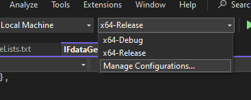

# IFdataGen - SignalSim IF Data Generator

## Overview

IFdataGen is a component of the SignalSim project that generates GNSS Intermediate Frequency (IF) data for various satellite navigation systems. The generated binary files can be used with RF front-ends or GNSS software-defined radio applications.

## GNSS Signal Frequencies and Bandwidths

Global Navigation Satellite Systems (GNSS) operate in specific frequency bands allocated by the International Telecommunication Union (ITU). Understanding these frequencies and the bandwidths of the signals is crucial for signal generation and processing.

Here's a summary of the center frequencies (Fc) for major GNSS signals:

| Constellation          | Signal    | Frequency Band | Center Frequency (Fc) (MHz)  | Typical Bandwidth (MHz) | Min Fs (MHz) |
| ---------------------- | --------- | -------------- | ---------------------------- | ----------------------- | ------------ |
| **GPS**          | L1 C/A    | L1             | 1575.42                      | 2.046 (main lobe)       | 2.046        |
|                        | L1C       | L1             | 1575.42                      | 4.092                   | 4.092        |
|                        | L2C       | L2             | 1227.60                      | 2.046 (L2CM)            | 2.046        |
|                        | L5        | L5             | 1176.45                      | 20.46                   | 20.46        |
| **BeiDou (BDS)** | B1C       | B1             | 1575.42                      | 4.092                   | 4.092        |
|                        | B1I       | B1             | 1561.098                     | 4.092                   | 4.092        |
|                        | B2I       | B2             | 1207.14                      | 4.092                   | 4.092        |
|                        | B2a       | B2             | 1176.45                      | 20.46                   | 20.46        |
|                        | B2b       | B2             | 1207.14                      | 20.46                   | 20.46        |
|                        | B3I       | B3             | 1268.52                      | 20.46                   | 20.46        |
| **Galileo**      | E1        | L1/E1          | 1575.42                      | 4.092 (OS)              | 4.092        |
|                        | E5a       | L5/E5a         | 1176.45                      | 20.46                   | 20.46        |
|                        | E5b       | E5b            | 1207.14                      | 20.46                   | 20.46        |
|                        | E5 AltBOC | E5             | 1191.795                     | 51.15                   | 51.15        |
|                        | E6        | E6             | 1278.75                      | 40.92                   | 40.92        |
| **GLONASS**      | G1        | L1             | 1602 + k * 0.5625 (k=-7..+6) | ~1 per channel          | 8 - 10       |
|                        | G2        | L2             | 1246 + k * 0.4375 (k=-7..+6) | ~0.8 per channel        | 6 - 8        |
|                        | G3        | L3             | 1202.025                     | 4.092                   | 4.092        |

**Notes:**

* **Bandwidth:** The listed bandwidths are approximate and can vary depending on the specific definition (e.g., main lobe, null-to-null, 99% power). For GLONASS FDMA signals, the listed bandwidth (~1 MHz for G1, ~0.8 MHz for G2) is for a *single satellite channel*. Capturing the *entire* G1 constellation requires a bandwidth of approximately 8-10 MHz, and the entire G2 constellation requires approximately 6-8 MHz.
* **Minimum Sampling Frequency (Min Fs):** This column indicates the theoretical minimum sampling frequency required to capture the signal without aliasing, based on the Nyquist-Shannon sampling theorem. For complex (I/Q) sampling, the minimum sampling rate is equal to the signal's bandwidth. For GLONASS, the Min Fs listed corresponds to a single channel; capturing the full constellation requires sampling at rates corresponding to the full constellation bandwidths mentioned above. The actual sampling frequency (`Fs`) used in a receiver or simulator (shown in the testing status tables below) is often higher to accommodate filter roll-off, capture multiple signals, or simplify processing.

## Signal Support and Testing Status

### Single-Constallations

The **`Fc`** and **`Fs`** in table below are the valuse used in **`.json`** file.

| Constellation     | Signal     | Fc (MHz) | Fs ( MHz) | Implementation            | Signal Generation Testing Status (Notes) | Signal Processing Testing Status (Notes)          |
| ----------------- | ---------- | -------- | --------- | ------------------------- | ---------------------------------------- | ------------------------------------------------- |
| **GPS**     | L1CA       | 1575.42  | 2.1       | 🟢                        | 🟢                                       | 🟢    [Tested With HackRF (Tx), PocketSDR (Rx)] |
|                   | L1C        | 1575.42  | 4.1       | 🟢                        | 🟢                                       | 🟡                                                |
|                   | L2C (L2CM) | 1227.60  | 4.1       | 🟢                        | 🟢                                       | 🟡                                                |
|                   | L5         | 1176.45  | 21        | 🟢                        | 🟢                                       | 🟡                                                |
|                   | L1P/L2P    | ----     | ---       | (Commercial license only) | (Commercial license only)                | (Commercial license only)                         |
| **BeiDou**  | B1C        | 1575.42  | 4.1       | 🟢                        | 🟢                                       | 🟡                                                |
|                   | B1I        | 1561.098 | 4.1       | 🟢                        | 🟢                                       | 🟡                                                |
|                   | B2I        | 1207.14  | 4.1       | 🟢                        | 🟢                                       | 🟡                                                |
|                   | B2a        | 1176.45  | 21        | 🟢                        | 🟢                                       | 🟡                                                |
|                   | B2b        | 1207.14  | 21        | 🟢                        | 🟢                                       | 🟡                                                |
|                   | B3I        | 1268.52  | 21        | 🟢                        | 🟢                                       | 🟡                                                |
| **Galileo** | E1         | 1575.42  | 4.1       | 🟢                        | 🟢                                       | 🟢    [Tested With HackRF (Tx), PocketSDR (Rx)] |
|                   | E5a        | 1176.45  | 21        | 🟢                        | 🟢 (F/NAV data modulation)               | 🟡                                                |
|                   | E5b        | 1207.14  | 21        | 🟢                        | 🟢 (I/NAV data modulation)               | 🟡                                                |
|                   | E5 AltBOC  | ----     | ---       | (Commercial license only) | (Commercial license only)                | (Commercial license only)                         |
|                   | E6         | 1278.75  | 41        | 🟢                        | 🟢                                       | 🟡                                                |
| **GLONASS** | G1         | 1602     | 10        | 🟢                        | 🟢 (FDMA implementation)                 | 🟡                                                |
|                   | G2         | 1202.025 | 8         | 🟢                        | 🟢 (FDMA implementation)                 | 🟡                                                |

### Multi-Constellations

| Constellation                              | Signals                                                                                    | Fc (MHz)  | Fs ( MHz) | Signal Generation Testing Status (Notes) | Signal Processing Testing Status (Notes) |
| ------------------------------------------ | ------------------------------------------------------------------------------------------ | --------- | --------- | ---------------------------------------- | ---------------------------------------- |
| **GPS + BeiDou + Galileo**           | [L1CA + L1C + B1C + E1](GNSS_Signal_Calculations.md#1-l1ca--l1c--b1c--e1)                     | 1575.42   | 4.092     | 🟢                                       | 🟡                                       |
| **GPS + BeiDou + Galileo**           | [L1CA + L1C + B1C + B1I + E1](GNSS_Signal_Calculations.md#2-l1ca--l1c--b1c--b1i--e1)          | 1568.286  | 18.48     | 🟢                                       | 🟡                                       |
| **GPS + BeiDou + Galileo + GLONASS** | [L1CA + L1C + B1C + B1I + E1 + G1](GNSS_Signal_Calculations.md#3-l1ca--l1c--b1c--b1i--e1--g1) | 1582.2105 | 46.329    | 🟢                                       | 🟡                                       |
| **GPS + BeiDou + Galileo + GLONASS** | [L2C + B2I + B2b + E5b + G2](GNSS_Signal_Calculations.md#4-l2c--b2i--b2b--e5b--g2)            | 1221.88   | 53.49     | 🟢                                       | 🟡                                       |
| **GPS + BeiDou + Galileo**           | [L5 + B2a + E5a](GNSS_Signal_Calculations.md#5-l5--b2a--e5a)                                  | 1176.45   | 24        | 🟢                                       | 🟡                                       |
| **BeiDou + Galileo**                 | [B3I + E6](GNSS_Signal_Calculations.md#6-b3i--e6)                                             | 1273.64   | 30.75     | 🟢                                       | 🟡                                       |

> **Legend**:
>
> * 🟢 Working / Complete: Feature has been fully implemented and verified
> * 🟡 Limited / Partial / Not Tested: Feature has partial implementation or limited verification or not tested
> * 🔴 Not Working: Feature is not implemented or not functioning correctly

### Note

> 1. The `" Signal Generation Testing Status"` indicates that the signals for the respective frequency bands have been successfully generated. However, the detailed evaluation of their characteristics—such as spectral purity, phase noise, modulation accuracy, and overall signal integrity—has not yet been performed.
> 2. The `" Signal Processing Testing Status"` indicates the testing of generated binary IF data file in a softwred based GNSS Reciver , like Pocket SDR, GNSS SDR etc.
> 3. For details on **`Fc`** and **`Fs`**  calculations, please refer to the [detailed calculations document](./GNSS_Signal_Calculations.md).

## Steps to Build IFdataGen

> **Note:** Signal Generation on Linux is much faster than Windows, so better use WSL atleast

### Linux (Ubuntu / Debian)

#### 1. Install Dependencies

```bash
sudo apt update
sudo apt install build-essential cmake ninja-build libomp-dev binutils-gold
```

#### 2. Obtain the Repository

Either clone the repository to your PC:

```cmd
git clone https://github.com/globsky/SignalSim.git
```

Or download the ZIP archive and extract it.

#### 3. Configure and build

Go inside  `SignalSim/IFDataGen/` dir. and follow either `4.1`, `4.2` or `4.13`.

#### 4.1 Release build (maximum speed)

```bash
cmake -S . -B out/build/release -G Ninja -DCMAKE_BUILD_TYPE=Release -DUSE_NATIVE_OPT=ON        # turn ON=default / OFF if you need portable binaries

cmake --build out/build/release -j$(nproc)
```

#### 4.2 RelWithDebInfo (optimised + symbols)

```bash
cmake -S . -B out/build/relwithdeb -G Ninja -DCMAKE_BUILD_TYPE=RelWithDebInfo
cmake --build out/build/relwithdeb -j$(nproc)
```

#### 4.3 Debug (no optimisation)

```bash
cmake -S . -B out/build/debug -G Ninja -DCMAKE_BUILD_TYPE=Debug
cmake --build out/build/debug -j$(nproc)
```

All binaries (`IFdataGen`) land in `out/build/(release or debug or relwithdeb)/` folder.

> Note : SO far Build tested on WSL (Ubuntu 24.04 LTS)

---

### Build Instructions on Windows

#### Prerequisites

* Microsoft Visual Studio (tested with VS 2022)
* CMake support enabled in Visual Studio (included by default in recent versions)

#### 1. Obtain the Repository

Either clone the repository to your PC:

```cmd
git clone https://github.com/globsky/SignalSim.git
```

Or download the ZIP archive and extract it.

#### 2. Open the Project Folder

* Launch Visual Studio
* Navigate to File > Open > Folder...
* Browse to the cloned SignalSim repository and select the `SignalSim` folder

#### 3. Configure the CMake Project

* Upon opening the folder, Visual Studio will detect the `CMakeLists.txt` files and a `CMake Integration` popup will appear

  
* Click `Enable and set source directory` and select the `CMakeLists.txt` file located at `<path-to-repo>/SignalSim/IFdataGen/CMakeLists.txt`
* Wait for the configuration process to complete. You should see this output in the console:

  ```cmd
  1> Extracted CMake variables.
  1> Extracted source files and headers.
  1> Extracted code model.
  1> Extracted toolchain configurations.
  1> Extracted includes paths.
  1> CMake generation finished.
  ```

#### 4. Select x64-Release (For fast signal generation)

Open dropdown menue and select `x64-Release`. Wait for few seconds, untill the IDE performs configurations.



#### 5. Build the Project

* Once the configuration is complete, build the project by navigating to Build > Build All or pressing `Ctrl + Shift + B`
* Upon successful build, you should see:

  ```cmd
  .
  .
  .
  Build All succeeded.
  ```

* The `IFdataGen.exe` executable will be generated in `<path-to-repo>/SignalSim/IFdataGen/out/build/(x64-Release or x64-Debug)/` folder

---

## Running IFdataGen

Running the `IFdataGen.exe` or (`IFdataGen` in case of linux), is same for Linux or Windows. But the path of executables will different in both cases.

### 1. Configure the Input JSON File

* Navigate to the `/SignalSim/IFdataGen/configs/` directory and open `IfGenTest.json` in a text editor
* Update the `ephemeris` section with the (absolute path, incase of path errors) to your RINEX file, currently paht is relative to the folder from where the executable is ran:

```json
"ephemeris": {
    "type": "RINEX",
    "name": "..\/EphData\/BRDC00IGS_R_20211700000_01D_MN.rnx"
}
```

* The provided `BRDC00IGS_R_20211700000_01D_MN.rnx` is a mixed RINEX file containing data for multiple constellations (GPS, Galileo, BeiDou, GLONASS)

  > **Note**: The simulation start time must be within range of **valid time frame** of selected ephermsis file.
  >

### 2. Generate the IF Data

Assuming you are in `IFdataGen` directory, runing the executable via the commond ` ./out/build/release/IFdataGen` in **Linux** or `.\out\build\x64-Release\IFdataGen` in **Window**s without additional arguments will produce the folllwing.

```bash
~/SignalSim/IFdataGen$  ./out/build/release/IFdataGen   # Linux
IFDataGen - GNSS IF Data Generator

Usage: IFdataGen [options]

Available options:
  --config, -c <FILE>     Configuration file (JSON) [REQUIRED]
  --output, -o <FILE>     Output IF data file (overrides config)
  --validate-only, -vo    Validate configuration and exit
  --parallel, -p          Use parallel execution (default)
  --serial, -s            Force serial execution
  --help, -h              Show this help message

Examples:
  IFdataGen -c config.json
  IFdataGen --config config.json --output mydata.bin
  IFdataGen -c config.json -o output.bin -s
  IFdataGen --config config.json -vo

Output structure:
  filename/
        |-- filename.bin     (IF data)
        |-- filename.bin.tag (metadata)
```

* Now lets pass the cofiguration json file to the generator. From the `IFdataGen` directory run:

  ```cmd
  ~/SignalSim/IFdataGen$ ./out/build/release/IFdataGen -c configs/GPS_BDS_GAL_L1CA_L1C_B1C_B1I_E1.json # Linux
  ```

* On successful execution, you'll see output similar to:

```cmd

================================================================================
                          IF SIGNAL GENERATION
================================================================================
[INFO]  Loading JSON file: configs/GPS_BDS_GAL_L1CA_L1C_B1C_B1I_E1.json
[INFO]  JSON file read successfully: configs/GPS_BDS_GAL_L1CA_L1C_B1C_B1I_E1.json
[INFO]  Loading ephemeris file: ../EphData/BRDC00IGS_R_20211700000_01D_MN.rnx
[INFO]  Ephemeris file loaded successfully: ../EphData/BRDC00IGS_R_20211700000_01D_MN.rnx
[INFO]  Creating output directory: bin_signals/GPS_BDS_GAL_L1CA_L1C_B1C_B1I_E1
[INFO]  Output directory created successfully: bin_signals/GPS_BDS_GAL_L1CA_L1C_B1C_B1I_E1
[INFO]  Creating tag file: bin_signals/GPS_BDS_GAL_L1CA_L1C_B1C_B1I_E1/GPS_BDS_GAL_L1CA_L1C_B1C_B1I_E1.bin.tag
[INFO]  Tag file created: bin_signals/GPS_BDS_GAL_L1CA_L1C_B1C_B1I_E1/GPS_BDS_GAL_L1CA_L1C_B1C_B1I_E1.bin.tag
[INFO]  Opening output file: bin_signals/GPS_BDS_GAL_L1CA_L1C_B1C_B1I_E1/GPS_BDS_GAL_L1CA_L1C_B1C_B1I_E1.bin
[INFO]  Output file opened successfully.
[INFO]  OpenMP configured for PARALLEL execution (20 threads auto-detected)
[INFO]  Generating IF data with following satellite signals:

[INFO]  Enabled Signals:
        GPS : [ L1CA L1C ]
        BDS : [ B1C B1I ]
        GAL : [ E1 ]

Signals Summary Table:
+---------------+-------------+--------------+------------------------------+
| Constellation | Visible SVs | Signals / SV | Total Signals / Visible SVs |
+---------------+-------------+--------------+------------------------------+
| GPS           | 9           | 2            | 18                           |
| BeiDou        | 10          | 2            | 20                           |
| Galileo       | 5           | 1            | 5                            |
| GLONASS       | 0           | 0            | 0                            |
+---------------+-------------+--------------+------------------------------+
Total Visible SVs = 24, Total channels = 43

GPS L1CA with IF +7134kHz:
+----+--------------+----+--------------+----+--------------+----+--------------+
| SV | Doppler (Hz) | SV | Doppler (Hz) | SV | Doppler (Hz) | SV | Doppler (Hz) |
+----+--------------+----+--------------+----+--------------+----+--------------+
| 03 |        -3765 | 04 |        -1899 | 07 |         +893 | 08 |        +2480 |
| 09 |         +133 | 14 |        +3721 | 16 |        -3263 | 27 |        +1169 |
| 30 |        +2352 |    |              |    |              |    |              |
+----+--------------+----+--------------+----+--------------+----+--------------+

GPS L1C with IF +7134kHz:
+----+--------------+----+--------------+----+--------------+----+--------------+
| SV | Doppler (Hz) | SV | Doppler (Hz) | SV | Doppler (Hz) | SV | Doppler (Hz) |
+----+--------------+----+--------------+----+--------------+----+--------------+
| 03 |        -3765 | 04 |        -1899 | 07 |         +893 | 08 |        +2480 |
| 09 |         +133 | 14 |        +3721 | 16 |        -3263 | 27 |        +1169 |
| 30 |        +2352 |    |              |    |              |    |              |
+----+--------------+----+--------------+----+--------------+----+--------------+

BeiDou B1C with IF +7134kHz:
+----+--------------+----+--------------+----+--------------+----+--------------+
| SV | Doppler (Hz) | SV | Doppler (Hz) | SV | Doppler (Hz) | SV | Doppler (Hz) |
+----+--------------+----+--------------+----+--------------+----+--------------+
| 08 |         -435 | 19 |        -3459 | 21 |        +1222 | 22 |        -1968 |
| 26 |        +2583 | 30 |        +1854 | 36 |        -1901 | 38 |         -371 |
| 42 |        +3123 | 45 |         +685 |    |              |    |              |
+----+--------------+----+--------------+----+--------------+----+--------------+

BeiDou B1I with IF -7188kHz:
+----+--------------+----+--------------+----+--------------+----+--------------+
| SV | Doppler (Hz) | SV | Doppler (Hz) | SV | Doppler (Hz) | SV | Doppler (Hz) |
+----+--------------+----+--------------+----+--------------+----+--------------+
| 08 |         -431 | 19 |        -3428 | 21 |        +1211 | 22 |        -1950 |
| 26 |        +2560 | 30 |        +1837 | 36 |        -1883 | 38 |         -368 |
| 42 |        +3094 | 45 |         +679 |    |              |    |              |
+----+--------------+----+--------------+----+--------------+----+--------------+

Galileo E1 with IF +7134kHz:
+----+--------------+----+--------------+----+--------------+----+--------------+
| SV | Doppler (Hz) | SV | Doppler (Hz) | SV | Doppler (Hz) | SV | Doppler (Hz) |
+----+--------------+----+--------------+----+--------------+----+--------------+
| 01 |        +1825 | 04 |        +2192 | 19 |         -370 | 21 |         -713 |
| 27 |        -2635 |    |              |    |              |    |              |
+----+--------------+----+--------------+----+--------------+----+--------------+

[INFO]  Starting signal generation loop...
[INFO]  Signal Duration: 10.00 s
[INFO]  Signal Size: 352.46 MB
[INFO]  Signal Data format: IQ8
[INFO]  Signal Center freq: 1568.2860 MHz
[INFO]  Signal Sample rate: 18.48 MHz

[======================100.0%======================] 10000/10000 ms | 352.46/352.46 MB | 13.66 MCOMPLETED: --

[INFO]  IF Signal generation completed!
------------------------------------------------------------------
[INFO]  Total samples: 369580000
[INFO]  Clipped samples: 3090133 (0.8361%)
[INFO]  Final AGC gain: 1.000
[INFO]  Total time taken: 25.81 s
[INFO]  Data generated: 352.46 MB
[INFO]  Average rate: 13.66 MB/s
------------------------------------------------------------------

```

* A `.bin` and `.bin.tag` files will be generated in `IFdataGen/bin_signals/fine_name/` directory. In above examlpe, the bin signal will land in `bin_signal/GPS_BDS_GAL_L1CA_L1C_B1C_B1I_E1` directory. The `file_name` is the name which you set in `.json` file, the `.bin.tag` contains metadata (compatible with PocketSDR) about the signal generated.

  ---

### Bonus: Generate Other multi-Constellation IF Data

Run the `IFdataGen.exe` with pre-computed examples `.json` files, present in `<path-to-repo>/SignalSim/IFdataGen/configs/` directory, to generate multi-constellation IF signals. Go inside `IFdataGen` directory and run the following commands:

1. **GPS + BeiDou + Galileo (L1 Bands)**:

   ```cmd
   ./out/build/release/IFdataGen -c configs/GPS_BDS_GAL_L1CA_L1C_B1C_B1I_E1.json # Linux
   .\out\build\x64-Release\IFdataGen -c configs\GPS_BDS_GAL_L1CA_L1C_B1C_B1I_E1.json # Windows (cmd/powersehh)
   ```
2. **GPS + BeiDou + Galileo (L1 Bands with B1I)**:

   ```cmd
   ./out/build/release/IFdataGen -c configs/GPS_BDS_GAL_L1CA_L1C_B1C_B1I_E1.json # Linux
   .\out\build\x64-Release\IFdataGen -c configs\GPS_BDS_GAL_L1CA_L1C_B1C_B1I_E1.json # Windows (cmd/powersehh)
   ```
3. **GPS + BeiDou + Galileo + GLONASS (L1/G1 Bands)**:

   ```cmd
   ./out/build/release/IFdataGen -c configs/GPS_BDS_GAL_GLO_L1CA_L1C_B1C_B1I_E1_G1.json # Linux
   .\out\build\x64-Release\IFdataGen -c configs\GPS_BDS_GAL_GLO_L1CA_L1C_B1C_B1I_E1_G1.json # Windows (cmd/powersehh)
   ```
4. **GPS + BeiDou + Galileo + GLONASS (L2/B2/G2 Bands)**:

   ```cmd
   ./out/build/release/IFdataGen -c configs/GPS_BDS_GAL_GLO_L2C_B2I_B2b_E5b_G2.json # Linux
   .\out\build\x64-Release\IFdataGen -c configs\GPS_BDS_GAL_GLO_L2C_B2I_B2b_E5b_G2.json # Windows (cmd/powersehh)
   ```
5. **GPS + BeiDou + Galileo (L5/E5a/B2a Bands)**:

   ```cmd
   ./out/build/release/IFdataGen -c configs/GPS_BDS_GAL_L5_B2a_E5a.json # Linux
   .\out\build\x64-Release\IFdataGen -c configs\GPS_BDS_GAL_L5_B2a_E5a.json # Windows (cmd/powersehh)
   ```
6. **BeiDou + Galileo (B3I/E6 Bands)**:

   ```cmd
   ./out/build/release/IFdataGen -c configs/BDS_GAL_B3I_E6.json # Linux
   .\out\build\x64-Release\IFdataGen -c configs\BDS_GAL_B3I_E6.json # Windows (cmd/powersehh)
   ```

---

## Using the Generated Data

The generated binary file can be:

* Fed into RF front-end hardware such as HackRF, PlutoSDR, etc.
  Hackrf example:

```bash
hackrf_transfer -t GPS_BDS_GAL_L1CA_L1C_B1C_B1I_E1.bin -f 1568286000 -s 18480000 -a 1 -x 47 -R
```

* Processed by GNSS software like GNSS-SDR or PocketSDR
* Used for testing and development of GNSS signal processing algorithms

## Supported Constellations

* GPS
* Galileo
* BeiDou
* GLONASS

## Additional Resources

For more information on SignalSim and its components, refer to the main project documentation in the repository root directory.
